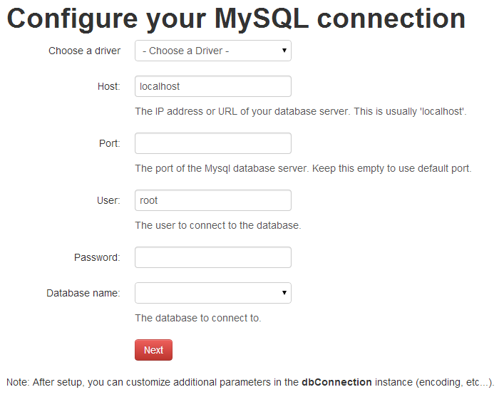

Doctrine DBAL wrapper classes for Mouf
=====================================

WARNING! IN DEVELOPMENT! NOT READY FOR PRODUCTION
=================================================

This package provides a wrapper around the Doctrine's DBALConnection class.

When installed, it provides a user-friendly user interface that allows to create / edit your connection to the database.

